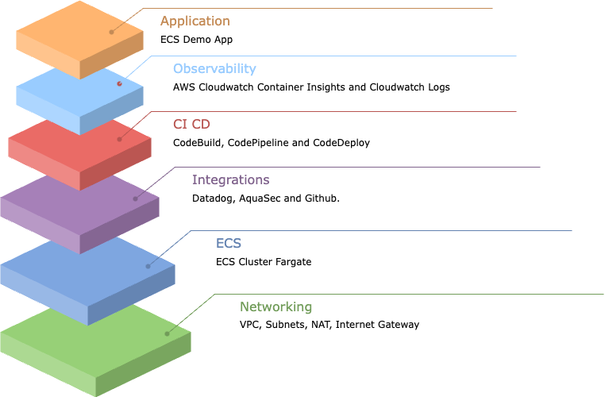
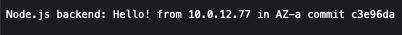

# Serverless Platform Operator Kit (SPOK)  

AWS SPOK, known as an opinionated solution bundle, offers a robust technical stack that emphasizes best practices. What this means for you is that launching production-level workloads on ECS can now be done much quicker. But it's not just about ECS and Fargate. SPOK also incorporates essential tools such as Terraform, GitHub, Amazon CloudWatch, and AWS Secrets Manager for establishing end-to-end solution. These services are the go-to choices for many customers already using ECS/Fargate, ensuring you're working with the tools that have proven their worth. Importantly, this bundle is designed to simplify your workflow, letting you focus more on what you do best.


## SPOK V1



## Pre-Requisites - Terraform

### General

The pre-requisites for deploying this offering are the following:

* Dynamodb Table (A single DynamoDB table is used to lock multiple remote state files)
* S3 Bucket (Stores the state as a given key in a given bucket)
* [Terraform](https://developer.hashicorp.com/terraform/tutorials/aws-get-started/install-cli) 

In case you don't have it, use this CLI to create the DynamoDB table it:

```shell
  aws dynamodb create-table --table-name TerraformLockStates \
  --attribute-definitions AttributeName=LockID,AttributeType=S \
  --key-schema AttributeName=LockID,KeyType=HASH \
  --billing-mode PAY_PER_REQUEST --region us-east-1
```

That CLI will create a DynamoDB table on us-east-1 region with name TerraformLockStates and pay per request billing mode, the table will have a Hash Key called LockID

Use this CLI to create the S3 bucket:

```shell
  account_id=$(aws sts get-caller-identity --query "Account" --output text) && \
  aws s3api create-bucket --bucket ${account_id}-terraform-states \
  --region us-east-1 --output text --no-cli-pager && aws s3api put-bucket-versioning \
  --bucket ${account_id}-terraform-states --versioning-configuration Status=Enabled
```

That CLI will crete a private S3 Bucket with name AccountID-terraform-states with versioning enabled by default.

## Getting started

To make it easy for you to get started with SPOK(Serverless Platform Operator Kit), here's a list of next steps. We are going to provision ECS Cluster with AWS Fargate, serverless compute engine for containers.

### Configure Backend

Go to your pattern and modify the following files:

* **backend.tf**

Replace the **bucket name** and **dynamodb_table**, if your region is different than us-east-1 also change **region**

```
terraform {
  backend "s3" {
    bucket         = "${account_id}-terraform-states" <--- here
    ...
    region         = "us-east-1" <--- here if your region is different than us-east-1
    dynamodb_table = "TerraformLockStates" <--- here
  }
}
```

### Deploy Your Pattern

Go to your pattern and run the following command:

```shell
terraform init
terraform validate
terraform plan #Here check the plan that Terraform outputs in case you want to change something.
terraform apply --auto-approve
```

---

### Choose your integration available on **terraform.tfvars**

Please refer following readme file for integration with third party patterns. 

* [Datadog](./docs/datadog.md)
* [AquaSec](./docs/aquasec.md)
* [Github Pipeline](./docs/github.md)

### Outputs
After the execution of the Terraform code you will get an output with needed IDs and values needed as input for the following *terraform apply*. You can use this infrastructure to run other examples, all you need is the `cluster_name`.

### Check Deployment Status
On the ECS Console you will find the **ecs-core** cluster, in it there will be a service called **ecsdemo-backend**, this service has an Application Load Balancer associated, you can execute the command **terraform output** on the **ecs-service** path and it will show the URL of the ALB, once you open that URL in a web browser it will show the following sample page:



If you keep refreshing the page it will show a different IP address and Availability Zone to demonstrate the Load Balancing.

### Cleanup
Run the following command if you want to delete all the resources created before. If you have created other blueprints and they use these infrastructure then destroy those blueprint resources first.

Go to your pattern and run the following command:
```shell
terraform destroy
```

Is possible that the deletion of the ECR Repository fails because there are images left on the repository, hence please delete manually the images and execute the command again.

Delete secrets immediately, in case of schedule for deletion change the parameter ```--force-delete-without-recovery``` to ```--recovery-window-in-days 7```

```shell
aws secretsmanager delete-secret \
    --secret-id datadog \
    --force-delete-without-recovery
```

```shell
aws secretsmanager delete-secret \
    --secret-id github \
    --force-delete-without-recovery
```

```shell
aws secretsmanager delete-secret \
    --secret-id /apps/docker/credentials \
    --force-delete-without-recovery
```

Delete Dynamodb Table (**NOTE**: Remember to the disable deletion protection):

```shell
aws dynamodb delete-table \
    --table-name TerraformLockStates
```

Delete S3 Bucket (**NOTE**: Remember first to emtpy the S3 Bucket):

```shell
account_id=$(aws sts get-caller-identity --query "Account" --output text)
aws s3api delete-bucket --bucket ${account_id}-terraform-states --region us-east-1
```

## Troubleshooting

### Error: Error acquiring the state lock

Error message: 2 errors occurred:
* ResourceNotFoundException: Requested resource not found
* ResourceNotFoundException: Requested resource not found

#### Solution

Create DynamoDB Table on **backend.tf** to store state lock (terraform.backend.dynamodb_table).
