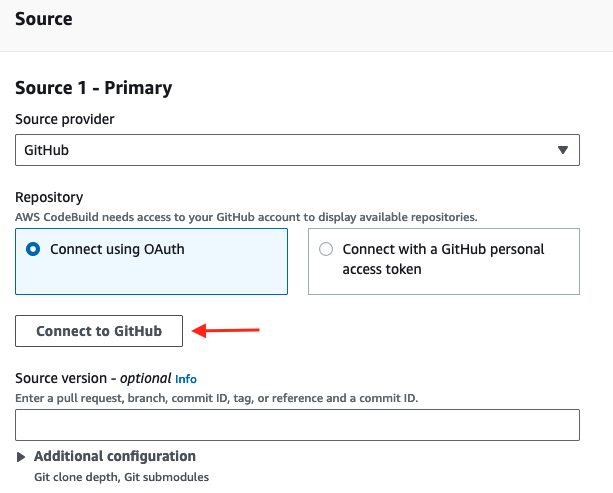
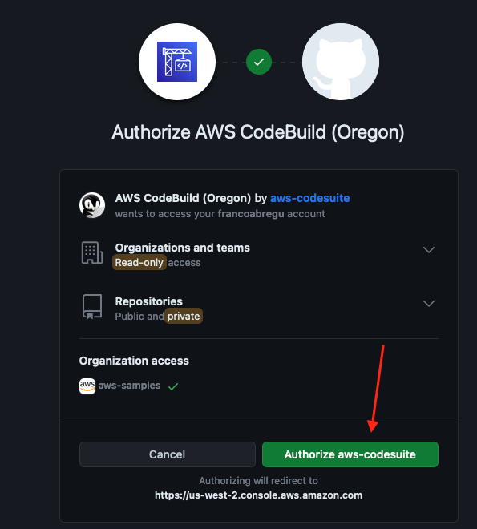

## CI/CD Component - Github integration module

You need to first create an **AWS CodeStar** connection in your account to connect **Github** with **AWS**. Once you have it, create an **AWS SecretsManager** secret using the following command:

```shell
aws secretsmanager create-secret \
    --name github \
    --description "Github Secrets" \
    --secret-string "{\"code_star_connection_arn\":\"...Here....\",\"organization_name\":\"...Here....\"}"
```

- **code_star_connection_arn**: Should be the ARN of the Connection between AWS CodePipeline and GitHub.
- **organization_name**: Should be the name of the organization used for the integration.

For more information about the values of the variables check the official docs related to [create the connection](https://docs.aws.amazon.com/codepipeline/latest/userguide/connections-github.html#connections-github-console).

Also, this module provides a way to run a github action from [GitHub Marketplace](https://github.com/marketplace?type=actions) using **AWS CodeBuild Github Actions Runner**. In order to configure the runner, you will need first to connect CodeBuild with github. Follow this steps to create a connection:

1. Go to CodeBuild console and select **create build project** 
2. Select github as Source and select connect to Github:



3. Accept the connection



4. Cancel the build project creation

Now your connection is available to use in any CodeBuild project. Just include any Github action in your **buildspec.yaml** and it will be able to use it.


For more details check this [guide](https://docs.aws.amazon.com/codebuild/latest/userguide/access-tokens.html#access-tokens-github)

Also, some github actions can use public images as source causing the following error:

```
toomanyrequests: You have reached your pull rate limit. You may increase the limit by authenticating and upgrading: https://www.docker.com/increase-rate-limit"
```

To avoid this, the module authenticates the steps using a dockerhub account. You will need to create a secret for the dockerhub credentials. Run the following command to create it:

```shell
aws secretsmanager create-secret \
    --name /apps/docker/credentials \
    --description "Github Secrets" \
    --secret-string "{\"username\":\"...Here....\",\"password\":\"...Here....\"}"
```

Configure the following parameters on **patterns/fargate-cluster/terraform.tfvars**:

```shell
################################################################################
# Module - Codepipeline with Github
################################################################################

enable_codepipeline_github = true

repository_name       = "my-example-app"
secret_manager_name   = "github"
```

Deploy Github CI/CD Integration:

```shell
terraform init
terraform validate
terraform plan #Here check the plan that Terraform outputs in case you want to change something.
terraform apply --auto-approve
```