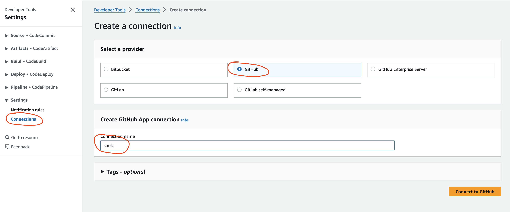
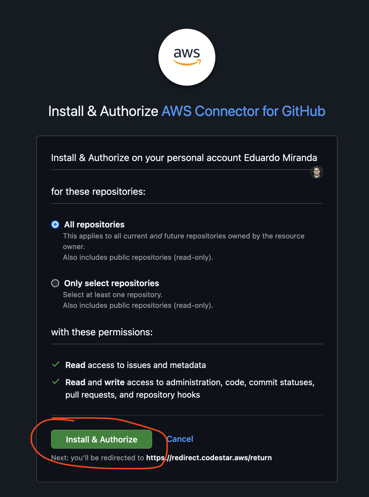

## CI/CD Component - Github integration module

You need to first create an **AWS CodeStar** connection in your account to connect **Github** with **AWS**. 

1. Go to Codepipeline console and select **Settings**, after go to **Connections** and click **Create Connection** button.
2. Select github as Provider and select connect to Github:



3. Accept the connection



4. after creation, copy ARN of connection and go to **patterns/fargate-cluster/terraform.tfvars** and change the following configuration:

```shell
################################################################################
# Module - Codepipeline with Github
################################################################################

enable_codepipeline_github = false -----> true

repository_name       = "ecsdemo-python" ------> your repository name, if you want to test the integration, our suggestion is do a Fork of the following project https://github.com/edmiranda/ecsdemo-python
secret_manager_name   = "github"

secret_github = {
  code_star_connection_arn = "arn:aws:codeconnections:us-east-1:xxxxxxx:connection/xxxxxx-xxxx-xxxx-xxxx-xxxxxxxxx"  ------> Your CodeConnection ARN
  organization_name        = "xxxxxxx" ------> Your Organization Name
}
```

Deploy Github CI/CD Integration:

```shell
terraform init
terraform validate
terraform plan #Here check the plan that Terraform outputs in case you want to change something.
terraform apply --auto-approve
```

### Cleanup

Removing ECR Images and S3 Bucket

```shell
./delete_ecr_images.sh us-east-1 ecs-core

ACCOUNT_ID=$(aws sts get-caller-identity --query Account --output text)

aws s3api delete-objects \
  --bucket $ACCOUNT_ID-ecs-github-pipeline-artifacts \
  --delete "$(aws s3api list-object-versions \
  --bucket "$ACCOUNT_ID-ecs-github-pipeline-artifacts" \
  --output=json \
  --query='{Objects: Versions[].{Key:Key,VersionId:VersionId}}')"

```

Disable integration:

```shell
################################################################################
# Module - Codepipeline with Github
################################################################################

enable_codepipeline_github = true -----> false

```

```shell
terraform apply

```